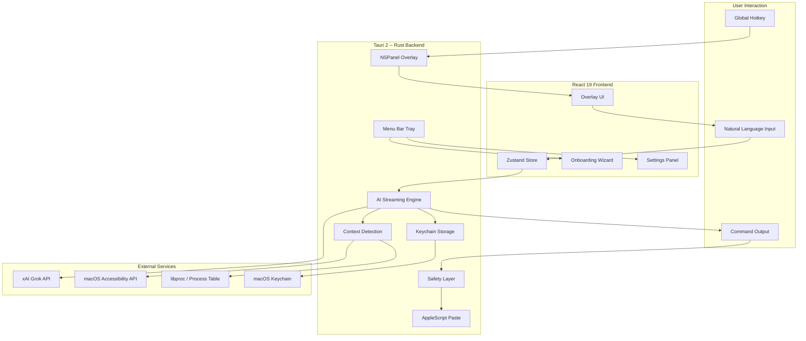

<div align="center">


# CMD+K

*AI-powered terminal commands, one keystroke away.*

Press Cmd+K from anywhere on your Mac. Type what you want. Get a working command. That's it.


[](https://github.com/LakshmanTurlapati/Cmd-K/stargazers)
[](https://github.com/LakshmanTurlapati/Cmd-K/network/members)
[](https://github.com/LakshmanTurlapati/Cmd-K/issues)
[](https://github.com/LakshmanTurlapati/Cmd-K/commits/main)

</div>

---

<div align="center">

[Features](#features) · [How It Works](#how-it-works) · [Architecture](#architecture) · [Tech Stack](#tech-stack) · [Quick Start](#quick-start) · [Project Structure](#project-structure) · [Contributing](#contributing)

</div>

---

## The Problem

You know *what* you want your terminal to do, but not the exact flags, pipes, or syntax to make it happen. So you context-switch to Stack Overflow, scan three half-relevant answers, copy a command you don't fully trust, and paste it back. Your flow is gone.

Shell plugins need dotfile wiring. Copilot needs a subscription and an IDE. ChatGPT needs a browser tab, a prompt, and manual copy-paste. None of them know what directory you're in or what you just ran.

## The Solution

CMD+K is a **native macOS overlay**. Press Cmd+K from any application, type plain English, and get a working terminal command -- streamed in real-time. It reads your terminal context (current directory, recent output, shell type) via the Accessibility API and process introspection. No plugins. No rc files. No IDE. No browser tab.

And when the generated command would `rm -rf` your home directory or `DROP` your production database, CMD+K tells you before you run it.

---

## Features

| Feature | Description |
|---|---|
| **System-Wide Overlay** | Floating NSPanel overlay triggered by a global hotkey from any application. No dock icon, no window clutter -- just a translucent command bar that appears and disappears. |
| **Natural Language Commands** | Describe what you want in plain English. xAI Grok models stream a working terminal command back token-by-token. |
| **Zero-Config Context Detection** | Reads your current working directory, shell type, and recent terminal output via macOS Accessibility API and libproc. No shell plugins, no rc file edits. |
| **Multi-Terminal Support** | Detects and reads context from Terminal.app, iTerm2, Alacritty, kitty, and WezTerm. Recognizes shells inside VS Code and Cursor. |
| **Browser DevTools Support** | Detects open DevTools consoles in Chrome, Safari, Firefox, Arc, Edge, and Brave. Switches to a conversational assistant mode for web debugging. |
| **Destructive Command Safety** | 50+ regex patterns flag dangerous commands (rm -rf, DROP TABLE, git push --force, etc.) with a red badge and an AI-generated plain-English explanation of the risk. |
| **Secure API Key Storage** | Your xAI API key lives in the macOS Keychain. It never touches a plaintext config file and never leaves the Rust backend. |
| **Smart Onboarding** | A 4-step wizard handles Accessibility permissions, API key validation, and model selection on first launch. No manual setup required. |
| **Configurable Hotkey** | Change the trigger shortcut to any key combination. Preset suggestions and a custom key recorder are built in. |
| **Lightweight Native App** | Built with Tauri 2 and Rust. Runs as a menu bar utility with minimal memory footprint. No Electron. No bundled Chromium. |

---

## How It Works

1. **Press the hotkey** -- Cmd+K (default) from any application. The overlay appears centered on your active screen.
2. **Type your intent** -- Describe what you want in natural language. "Find all PDFs modified this week" or "Kill whatever is hogging port 3000."
3. **Context is gathered** -- CMD+K captures the foreground app's PID, resolves the active terminal's working directory, shell type, and recent visible output via Accessibility API.
4. **AI generates the command** -- Your query plus context is sent to xAI. The response streams token-by-token into the results area with shell syntax highlighting.
5. **Safety check runs** -- Once generation completes, the command is scanned against 50+ destructive patterns. Matches trigger a red badge with an AI-powered risk explanation.
6. **Copy or auto-paste** -- Click the result to copy to clipboard, or let CMD+K paste directly into Terminal.app or iTerm2 via AppleScript.
7. **Dismiss** -- Press Escape. The overlay vanishes. Focus returns to your previous application.

---

## Architecture



---

## Tech Stack

**Backend (Rust)**


**Frontend**


**AI**


---

## Quick Start

### Prerequisites

- macOS 13+ (Ventura or later)
- [Rust](https://rustup.rs/) (latest stable)
- [Node.js](https://nodejs.org/) 18+
- [pnpm](https://pnpm.io/)
- An [xAI API key](https://console.x.ai/)

### Install & Run

```bash
# Clone the repository
git clone https://github.com/LakshmanTurlapati/Cmd-K.git
cd Cmd-K

# Install frontend dependencies
pnpm install

# Start in development mode
pnpm tauri dev
```

### First Run

On first launch, the onboarding wizard will walk you through:

1. **Accessibility Permission** -- CMD+K needs this to read terminal context. The wizard links you to System Settings.
2. **API Key** -- Enter your xAI API key. It's validated against the xAI API and stored in your macOS Keychain.
3. **Model Selection** -- Choose your preferred Grok model (grok-3 recommended).

### Build for Production

```bash
pnpm tauri build
```

The `.dmg` installer will be in `src-tauri/target/release/bundle/dmg/`.

---

## Project Structure

```
cmd-k/
├── src/                          # React 19 frontend
│   ├── main.tsx                  # App entrypoint
│   ├── App.tsx                   # Initialization, onboarding gate
│   ├── store/
│   │   └── index.ts              # Zustand store (modes, streaming, settings)
│   ├── components/
│   │   ├── Overlay.tsx           # Main overlay container, dismiss handlers
│   │   ├── CommandInput.tsx      # Auto-growing textarea, /settings trigger
│   │   ├── ResultsArea.tsx       # Streaming display, syntax highlighting, copy
│   │   ├── DestructiveBadge.tsx  # Red warning badge with AI tooltip
│   │   ├── HotkeyConfig.tsx      # Hotkey rebinding dialog
│   │   ├── HotkeyRecorder.tsx    # Custom key capture
│   │   ├── Onboarding/           # 4-step setup wizard
│   │   └── Settings/             # Tabbed preferences panel
│   ├── hooks/
│   │   ├── useKeyboard.ts        # Escape dismiss, Ctrl+C cancel
│   │   └── useWindowAutoSize.ts  # Dynamic Tauri window sizing
│   └── lib/
│       └── utils.ts              # Tailwind merge utilities
│
├── src-tauri/                    # Tauri 2 Rust backend
│   ├── Cargo.toml                # Rust dependencies
│   ├── src/
│   │   ├── main.rs               # Binary entrypoint
│   │   ├── lib.rs                # Tauri app init, NSPanel, plugins
│   │   ├── state.rs              # AppState (hotkey, visibility, PID)
│   │   ├── commands/
│   │   │   ├── ai.rs             # SSE streaming to xAI, two-mode prompts
│   │   │   ├── xai.rs            # API validation, model fetching
│   │   │   ├── safety.rs         # 50+ destructive regex patterns, AI explanation
│   │   │   ├── terminal.rs       # Context detection IPC bridge
│   │   │   ├── paste.rs          # AppleScript dispatch to terminals
│   │   │   ├── keychain.rs       # macOS Keychain read/write
│   │   │   ├── hotkey.rs         # Global shortcut registration
│   │   │   ├── window.rs         # Overlay positioning, multi-monitor
│   │   │   ├── tray.rs           # Menu bar tray icon and menu
│   │   │   └── permissions.rs    # Accessibility permission check
│   │   └── terminal/
│   │       ├── detect.rs         # Bundle ID resolution, app name cleaning
│   │       ├── process.rs        # libproc CWD/shell/process tree walking
│   │       ├── ax_reader.rs      # Accessibility API text extraction
│   │       ├── browser.rs        # Browser DevTools console detection
│   │       └── filter.rs         # Sensitive data scrubbing
│   └── icons/                    # App icons
│
├── extension/                    # Legacy: VS Code extension
├── cli/                          # Legacy: VS Code extension CLI
├── K.png                         # Menu bar tray icon
├── LICENSE                       # MIT
└── package.json                  # Frontend dependencies
```

---

## Supported Terminals

| Terminal | Context Detection | Output Reading | Notes |
|---|---|---|---|
| **Terminal.app** | Full (CWD, shell, output) | Accessibility API | Full auto-paste via AppleScript |
| **iTerm2** | Full (CWD, shell, output) | Accessibility API | Full auto-paste via AppleScript |
| **Alacritty** | Partial (CWD, shell) | Not available | GPU-rendered; no AX text exposure |
| **kitty** | Partial (CWD, shell) | Not available | GPU-rendered; no AX text exposure |
| **WezTerm** | Partial (CWD, shell) | Not available | GPU-rendered; no AX text exposure |
| **VS Code / Cursor** | Shell detected inside editor | Via editor AX tree | Integrated terminal recognized as shell |
| **Browser DevTools** | Console detected | Not applicable | Chrome, Safari, Firefox, Arc, Edge, Brave |

---

## Configuration

| Setting | Location | Description |
|---|---|---|
| **API Key** | macOS Keychain (`com.lakshmanturlapati.cmd-k`) | xAI API key. Never stored in plaintext. Never sent to the frontend. |
| **Model** | Tauri Store (`settings.json`) | Grok model selection: `grok-3` (default), `grok-3-mini`, `grok-4`, `grok-4-fast` |
| **Hotkey** | Tauri Store (`settings.json`) | Global trigger shortcut. Default: `Cmd+K`. Supports any modifier+key combination. |
| **Destructive Detection** | Settings > Preferences | Toggle safety pattern scanning on/off. Default: enabled. |
| **Auto-Paste** | Settings > Preferences | Auto-paste generated commands to active terminal. Default: enabled. |

---

## Roadmap

- [x] **Phase 1** -- Foundation & Overlay: System-wide NSPanel with global hotkey
- [x] **Phase 2** -- Settings & Configuration: Keychain storage, onboarding wizard
- [ ] **Phase 3** -- Terminal Context Reading: CWD, shell, output detection across terminals
- [x] **Phase 4** -- AI Command Generation: xAI streaming, two-mode prompts, syntax highlighting
- [x] **Phase 5** -- Safety Layer: Destructive pattern detection, AI risk explanations
- [ ] **Phase 6** -- Terminal Pasting: AppleScript auto-paste with clipboard fallback

---

## Contributing

1. **Fork** the repository
2. **Create** a feature branch (`git checkout -b feature/your-feature`)
3. **Commit** your changes (`git commit -m "Add your feature"`)
4. **Push** to the branch (`git push origin feature/your-feature`)
5. **Open** a Pull Request

**Architecture notes for contributors:** The Rust backend (`src-tauri/src/`) handles all system interactions -- Accessibility API, Keychain, process introspection, AI streaming. The React frontend (`src/`) is purely UI and state. All communication goes through Tauri IPC commands defined in `src-tauri/src/commands/`. If you're adding a new system capability, start with a Rust command and expose it to the frontend via `#[tauri::command]`.

---

## License

[MIT](LICENSE)

---

<div align="center">

Built by [Lakshman Turlapati](https://github.com/LakshmanTurlapati)

If CMD+K saved you a trip to Stack Overflow, consider giving it a star.

</div>
